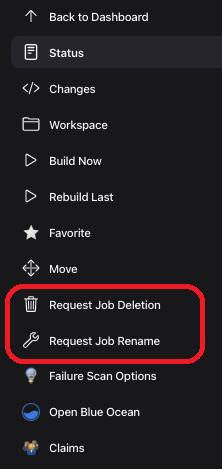
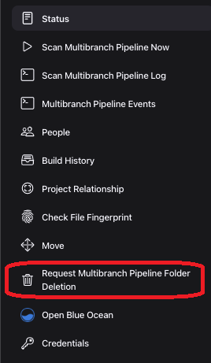
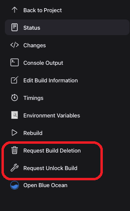
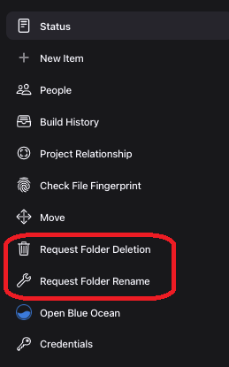
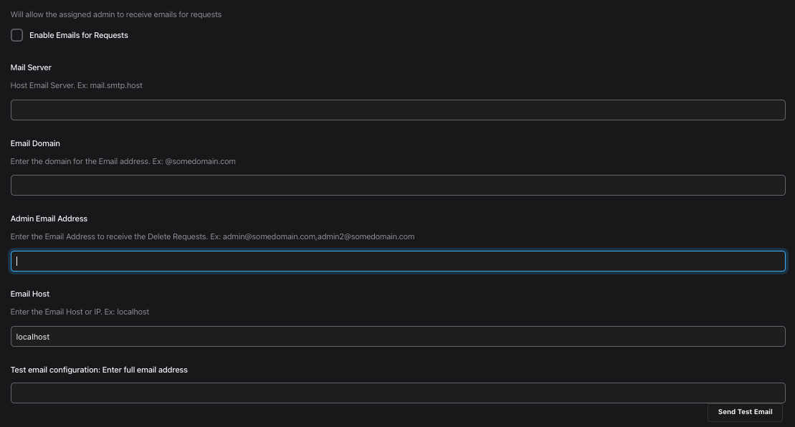
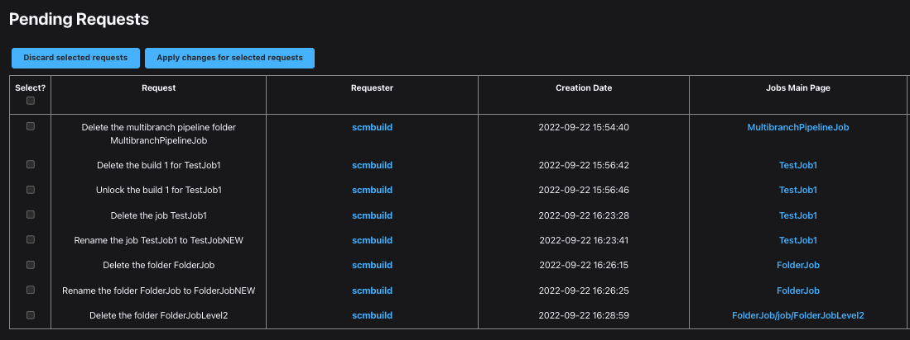

Requests Plugin

This plugin sets up a request center for non-admin users to be able to
ask that their job to be deleted or renamed, or a build to be deleted or
unlocked.

## Summary

The plugin adds 2 new actions to the job screen so that users who don't
have the required permissions to delete or to rename Jobs, to send a
request to the Jenkins administrator to do so.  It also adds 2 new
actions to the build screen so that users who don't have the required
permissions to delete or unlock builds can send a request to the Jenkins
administrator to do so. 

  
The Jenkins administrator then gets a dedicated screen to handle all the
incoming requests. If configured, an email will be sent to the assigned
admin person and the submitter of the request. The admin user can then
review the request and then apply the changes with just a click of a
button.

------------------------------------------------------------------------

## For Users

For users who don't have permissions to Delete/Rename a Job,
Delete/Unlock a Build, Delete/Rename a Folder, or Delete a Multibranch Pipeline. The following actions are
available if enabled.

-   Request For Job Deletion
- 	Request For Job Rename
-   Request For Build Deletion
-   Request For Build Unlock
-   Request For Folder Deletion
- 	Request For Folder Rename
- 	Request For Multibranch Pipleline Deletion

  

### Job Requests
 
### Multibranch Pipeline Requests
 
### Build Requests
 
### Folder Requests
 

------------------------------------------------------------------------

## For Administrators

The Global Settings allow the admin to enable/disable any of the available
actions and to enable e-mail notifications (**Manage
Jenkins** \> **Configure System**):

-   It's important to note that when making a change to the "Enable the
    link for Delete Job Request" a restart of Jenkins is required so
    that all applicable jobs receive the action.
-   Make sure to save email configuration changes before clicking the
    "Send Test Email" button.
-   Discard old builds must be enabled in the job configuration before
    you can view the "Keep this build forever" option.

  

 

 

  
Administrators get a new **Pending  Requests** entry in Jenkins' main
configuration screen (**Manage Jenkins - Tools and Actions**):  

 

Lack of Permissions in order to see the links if enabled
---
### Delete Job/Folder/Multibranch Pipeline Request       
- !Job.Delete

### Delete/Unlock Build Request

- !Run.Delete

### Rename Job/Folder Request       
- (!Job.Delete and !Job.Configure and Job.Create) OR
- (!Job.Create and !Job.Configure and Job.Delete) OR
- (!Job.Delete and !Job.Create and !Job.Configure)

If permissions are set within a job, it will affect the above permission patterns.

  

  
