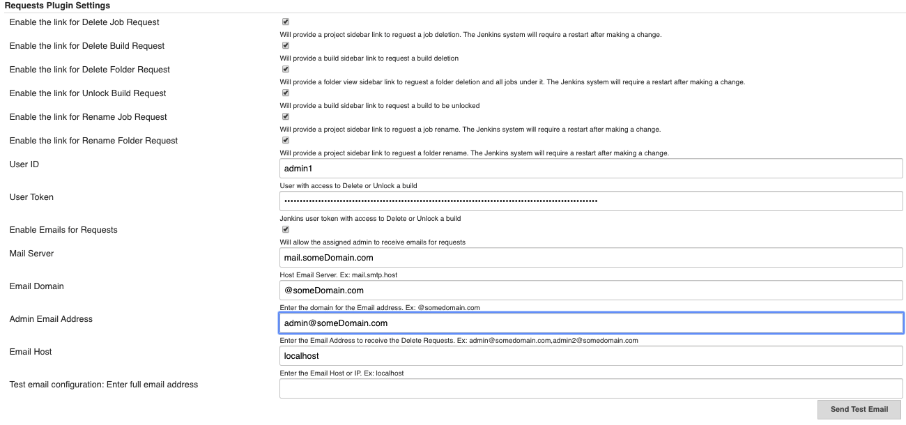

Requests Plugin

This plugin sets up a request center for non-admin users to be able to
ask that their job to be renamed or deleted, a build to be unlocked or
deleted, or a folder to be renamed or deleted.

## Summary

The plugin adds up to 6 requests that can be enabled from the global Jenkins configuration.  The Job requests adds a sidebar link to rename or delete a job. The Build requests adds a sidebar link to unlock (not Keep forever) or delete a build. The Folder requests adds a sidebar link to rename or delete a folder and any other items under it such as another folder or job. When a request is submitted, an 
email request is sent to the Jenkins administrator to be fulfilled.  

  
The Jenkins administrator gets a dedicated Pending Requests page to handle all the
incoming requests from the manage Jenkins page. If configured, an email will be sent to the assigned
administrator contact and the submitter of the request. The email will contain 2 links.  One to the job, build, or folder for the request and another directly to the Pending requests page. The administrator can then
review the request and then apply the changes with just a click of a button.

------------------------------------------------------------------------

## For Users

For users who don't have permissions to Delete a Job, Rename a Job,
Delete a Build, Unlock a Build, Rename a Folder, or Delete a Folder, the following 6 actions are
available if enabled. If a user does have the correct permissions to perform one of the actions, they will not see the links.

Sidebar link added to Job page:
-   Request For Job Deletion
-   Request For Job Rename

Sidebar link added to Build page:
-   Request For Build Deletion
-   Request To Unlock Build

Sidebar link added to Folder page:
-   Request For Folder Deletion
-	Request For Folder Rename                      

  

------------------------------------------------------------------------

## For Administrators

The Global Settings allow the administrator to enable/disable any of the 6
actions and to enable e-mail notifications (**Manage
Jenkins** \> **Configure System**):

-   It's important to note that when making a change to the Request options a restart of Jenkins is required so
    that all applicable sidebar links are presented in the correct locations.
-   Make sure to save email configuration changes before clicking the
    "Send Test Email" button.
-   Discard old builds must be enabled in the job configuration before
    you can view the "Keep this build forever" option.

  

                           
 {.confluence-embedded-image
width="1100"}

        

  
Administrators get a new **Pending  Requests** entry in Jenkins' main
configuration screen (**Manage Jenkins**):  

                         
 {.confluence-embedded-image
height="81"}

------------------------------------------------------------------------

                           
  {.confluence-embedded-image
width="700"}

------------------------------------------------------------------------

                        

#### Required permissions in order to see the sidebar links:

[Delete Job Request] 	Job.Delete = 0, Job.Configure = 1

[Delete Build Request] 	Run.Delete = 0

[Delete Folder Request] 	Run.Delete = 0, Job.Configure = 1

[Unlock Build Request] 	Run.Delete = 0

[Rename Job Request] 	Job.Create = 1, Job.Delete = 0, Job.Configure = 0 OR Job.Create = 0, Job.Delete = 1, Job.Configure = 0

[Rename Folder Request] 	Job.Create = 1, Job.Delete = 0, Job.Configure = 0 OR Job.Create = 0, Job.Delete = 1, Job.Configure = 0

  

  

  
